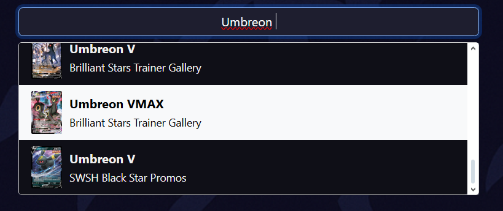
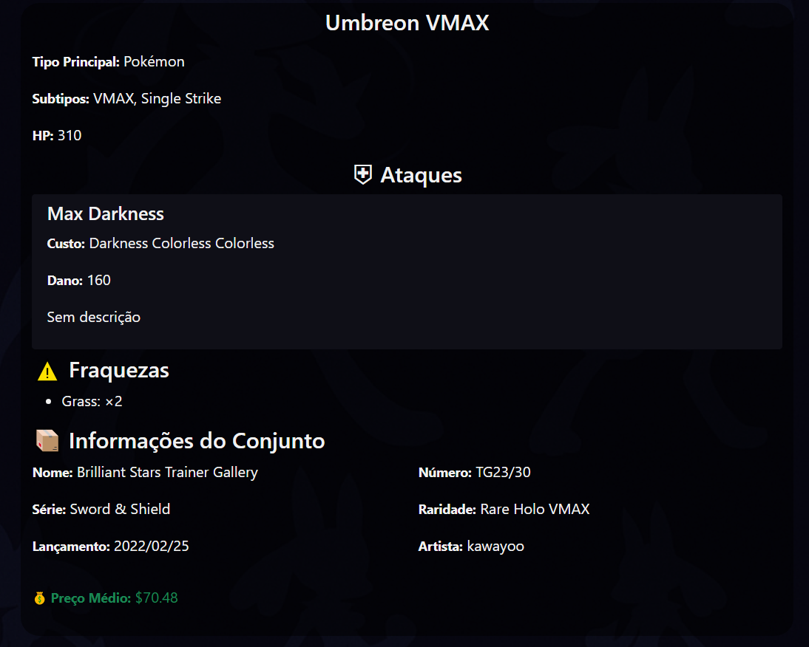

# Dashboard de Pokémon TCG 🎴

Dashboard de Cartas Pokémon com Reactjs e Vite, feito como trabalho de faculdade na cadeira de Front-End
Disponivel em: http://tcgdashboard-trab-facul.vercel.app


# Funcionalidades do Dashboard de Cartas Pokémon 🤩

--

## 1. Exibição de cartas salvas 💾

- Exibe, no topo da página, miniaturas das cartas que o usuário salvou anteriormente (`armazenadas em localStorage`).
- Se não houver cartas salvas, mostra “Nenhuma carta salva.”
- Exibe uma animação intuitiva ao tentar remover a carta do seu deck salvo.

## 2. Campo de busca de cartas por nome 🔍

- Permite o usuário pesquisar por nome a carta desejada e filtra as buscas conforme vai sendo digitado.
- Mostra as cartas que passaram no filtro como sujestão para a escolha.




- A Busca é feita via: 
```js
PokemonTCG.card.where({
  q: `name:${searchTerm.split(' ')[0]}*`,
  pageSize: 40,
});
```
## 3. Exibição Detalhada do Card 📊



- Ao pesquisar, renderiza:
  - Imagem em alta resolução (`images.large`).
  - Nome, supertype e subtypes.
  - HP e tipos.
  - Evoluções (`evolvesTo`).
  - Regras especiais (`rules`).
  - Lista de ataques com custo, dano e texto.
  - Fraquezas e custo de recuo.
  - Informações do conjunto (nome e data de lançamento).
  - Número, raridade e artista.
  - Preço médio de mercado (via `tcgplayer.prices.holofoil.market`).

## 4. Salvar cartas 📌

- Botão “Salvar Carta” para persistir o card atual em `localStorage`.
- Evita duplicatas (desabilita o botão se o card já estiver salvo).